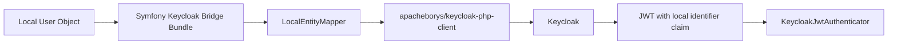

# Symfony Keycloak Bridge Bundle

`apacheborys/symfony-keycloak-bundle` is a thin Symfony bridge over
`apacheborys/keycloak-php-client`.

The goal is simple:

- keep your Symfony user entity as the source of truth
- map it into Keycloak with very little configuration
- verify Keycloak JWT tokens inside Symfony Security
- still leave enough extension points for real-world projects

In the happy path you configure only:

- Keycloak base client credentials
- a unique application `callsign`
- the target realm for each user entity

Everything else can be inferred:

- the bundle uses `KeycloakUserInterface::getId()` as the canonical local identifier automatically
- the bundle prepends the configured `callsign.` to every Keycloak-facing attribute value and role name
- the default mapper projects that identifier into Keycloak attributes through that `callsign`
- the same identifier is expected in JWT payload automatically
- custom attribute mapping, role projection, and custom mappers stay opt-in



## Install

```bash
composer require apacheborys/symfony-keycloak-bundle
```

Enable the bundle:

```php
// config/bundles.php
return [
    Apacheborys\SymfonyKeycloakBridgeBundle\KeycloakBridgeBundle::class => ['all' => true],
];
```

## Minimal Config

```yaml
# config/packages/keycloak_bridge.yaml
keycloak_bridge:
  base_url: '%env(KEYCLOAK_BASE_URL)%'
  client_realm: '%env(KEYCLOAK_CLIENT_REALM)%'
  client_id: '%env(KEYCLOAK_CLIENT_ID)%'
  client_secret: '%env(KEYCLOAK_CLIENT_SECRET)%'
  callsign: '%env(KEYCLOAK_CALLSIGN)%'
  user_entities:
    App\Entity\User:
      realm: '%env(KEYCLOAK_USERS_REALM)%'
```

That is enough to start:

- `App\Entity\User` must implement `Apacheborys\KeycloakPhpClient\Entity\KeycloakUserInterface`
- `callsign` must be unique per application that talks to the same Keycloak realms
- the bundle uses `KeycloakUserInterface::getId()` as the local-to-Keycloak reference value
- that identifier is automatically added to Keycloak attributes during user sync under `external-user-id`
- the stored Keycloak value becomes `callsign.<local-id>`, for example `billing.58f5b67f-bcf4-4d12-86a3-a54f7704f326`
- the same prefixed value is expected in JWT payload after you bootstrap the Keycloak attribute once under `external_user_id`
- `KeycloakJwtAuthenticator` strips the `callsign.` prefix back off and exposes the raw local identifier to Symfony

This minimal setup assumes your container already provides:

- a PSR-18 HTTP client
- PSR-17 request and stream factories

Important distinction:

- `getId()` is used as the local-to-Keycloak reference attribute value
- `getKeycloakId()` is used first for Keycloak-side update, delete, and lookup operations
- if `getKeycloakId()` is `null`, the client falls back to the mapped local-id Keycloak attribute using the callsigned value returned by the mapper

## Start Here

- [Quick Start](docs/quick-start.md)
  Full happy-path example with minimal config, one-time bootstrap through `KeycloakBootstrapper`, and create/update/delete calls.
- [Configuration Guide](docs/configuration.md)
  Required fields, optional fields, `attributes_map`, `required`, entity-level `role` settings, custom mapper wiring, and automatic identifier behavior.
- [Security Guide](docs/security.md)
  `KeycloakJwtAuthenticator`, JWT identifier claim resolution, firewall setup, and role extraction.

## Authentication Failure Handling

`KeycloakJwtAuthenticator` catches the typed exception model provided by
`apacheborys/keycloak-php-client` during JWT verification.

Behavior summary:

- malformed or otherwise invalid JWT input still returns `401 Unauthorized`
- typed Keycloak or JWKS infrastructure failures are converted into controlled JSON responses
- by default those failures keep their mapped operational status codes:
  `429` for rate limiting, `502` for invalid Keycloak responses, and `503` for temporary
  upstream unavailability
- if you set `keycloak_bridge.security.expose_infrastructure_failure_status: false`, the
  authenticator always responds with `401` instead

The response body is intentionally minimal and safe:

```json
{
  "message": "Authentication failed.",
  "reason": "keycloak_unavailable"
}
```

Security guarantees:

- raw JWT values are never returned to clients
- the `Authorization` header is never returned to clients
- `client_secret`, `access_token`, `refresh_token`, and `password` values are never returned
- raw Keycloak response bodies are not exposed to end users

If `logger_service` is configured, the authenticator logs sanitized diagnostic context from
`KeycloakErrorContext`, including HTTP method, sanitized URI, status code, sanitized Keycloak
error fields, correlation id, and exception class.

## Services

You can autowire these interfaces directly:

- `Apacheborys\KeycloakPhpClient\Http\KeycloakHttpClientInterface`
- `Apacheborys\KeycloakPhpClient\Service\KeycloakServiceInterface`
- `Apacheborys\KeycloakPhpClient\Service\KeycloakJwtVerificationServiceInterface`
- `Apacheborys\KeycloakPhpClient\Service\KeycloakOidcAuthenticationServiceInterface`
- `Apacheborys\KeycloakPhpClient\Service\KeycloakUserIdentifierAttributeServiceInterface`
- `Apacheborys\KeycloakPhpClient\Service\KeycloakUserManagementServiceInterface`
- `Apacheborys\KeycloakPhpClient\Service\KeycloakRealmServiceInterface`
- `Apacheborys\SymfonyKeycloakBridgeBundle\Security\KeycloakJwtAuthenticator`
- `Apacheborys\SymfonyKeycloakBridgeBundle\Service\KeycloakBootstrapper`

## Design Notes

- The bundle does not mutate Keycloak realm configuration automatically during `createUser()`, `updateUser()`, or `loginUser()`.
- Keycloak profile attribute bootstrap is an explicit application concern via `KeycloakBootstrapper`.
- Use `ensureUserIdentifierAttribute()` for the minimal happy path, or `ensureConfiguredAttributes()` when you want the whole `attributes_map` to be synchronized explicitly.
- The default mapper is intentionally conservative; if your app needs different login or projection rules, switch the entity to a custom mapper.

## Development

```bash
composer install
composer check
```

To enable git hooks:

```bash
git config core.hooksPath .githooks
```
