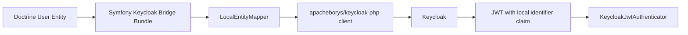

# Symfony Keycloak Bridge Bundle

`apacheborys/symfony-keycloak-bundle` is a thin Symfony bridge over
`apacheborys/keycloak-php-client`.

The goal is simple:

- keep your Symfony user entity as the source of truth
- map it into Keycloak with very little configuration
- verify Keycloak JWT tokens inside Symfony Security
- still leave enough extension points for real-world projects

In the happy path you configure only:

- Keycloak base client credentials
- the target realm for each user entity

Everything else can be inferred:

- Doctrine resolves the local identifier field automatically
- the default mapper projects that identifier into Keycloak attributes
- the same identifier is expected in JWT payload automatically
- custom attribute mapping, role projection, and custom mappers stay opt-in



## Install

```bash
composer require apacheborys/symfony-keycloak-bundle
```

Enable the bundle:

```php
// config/bundles.php
return [
    Apacheborys\SymfonyKeycloakBridgeBundle\KeycloakBridgeBundle::class => ['all' => true],
];
```

## Minimal Config

```yaml
# config/packages/keycloak_bridge.yaml
keycloak_bridge:
  base_url: '%env(KEYCLOAK_BASE_URL)%'
  client_realm: '%env(KEYCLOAK_CLIENT_REALM)%'
  client_id: '%env(KEYCLOAK_CLIENT_ID)%'
  client_secret: '%env(KEYCLOAK_CLIENT_SECRET)%'
  user_entities:
    App\Entity\User:
      realm: '%env(KEYCLOAK_USERS_REALM)%'
```

That is enough to start:

- `App\Entity\User` must be a Doctrine-managed entity
- the bundle resolves its identifier field from Doctrine metadata
- that identifier is automatically added to Keycloak attributes during user sync
- the same identifier is expected in JWT payload after you bootstrap the Keycloak attribute once

This minimal setup assumes your container already provides:

- `Doctrine\Persistence\ManagerRegistry`
- a PSR-18 HTTP client
- PSR-17 request and stream factories

Your user entity must also implement
`Apacheborys\KeycloakPhpClient\Entity\KeycloakUserInterface`.

Important distinction:

- the Doctrine identifier is used as the local-to-Keycloak reference attribute
- `getKeycloakId()` is used for Keycloak-side update, delete, and lookup operations

## Start Here

- [Quick Start](docs/quick-start.md)
  Full happy-path example with minimal config, one-time bootstrap through `KeycloakBootstrapper`, and create/update/delete calls.
- [Configuration Guide](docs/configuration.md)
  Required fields, optional fields, `attributes_map`, `required`, entity-level `role` settings, custom mapper wiring, and automatic Doctrine behavior.
- [Security Guide](docs/security.md)
  `KeycloakJwtAuthenticator`, JWT identifier claim resolution, firewall setup, and role extraction.

## Services

You can autowire these interfaces directly:

- `Apacheborys\KeycloakPhpClient\Http\KeycloakHttpClientInterface`
- `Apacheborys\KeycloakPhpClient\Service\KeycloakServiceInterface`
- `Apacheborys\KeycloakPhpClient\Service\KeycloakJwtVerificationServiceInterface`
- `Apacheborys\KeycloakPhpClient\Service\KeycloakOidcAuthenticationServiceInterface`
- `Apacheborys\KeycloakPhpClient\Service\KeycloakUserIdentifierAttributeServiceInterface`
- `Apacheborys\KeycloakPhpClient\Service\KeycloakUserManagementServiceInterface`
- `Apacheborys\KeycloakPhpClient\Service\KeycloakRealmServiceInterface`
- `Apacheborys\SymfonyKeycloakBridgeBundle\Security\KeycloakJwtAuthenticator`
- `Apacheborys\SymfonyKeycloakBridgeBundle\Service\KeycloakBootstrapper`

## Design Notes

- The bundle does not mutate Keycloak realm configuration automatically during `createUser()`, `updateUser()`, or `loginUser()`.
- Keycloak profile attribute bootstrap is an explicit application concern via `KeycloakBootstrapper`.
- Use `ensureUserIdentifierAttribute()` for the minimal happy path, or `ensureConfiguredAttributes()` when you want the whole `attributes_map` to be synchronized explicitly.
- The default mapper is intentionally conservative; if your app needs different login or projection rules, switch the entity to a custom mapper.

## Development

```bash
composer install
composer check
```

To enable git hooks:

```bash
git config core.hooksPath .githooks
```
