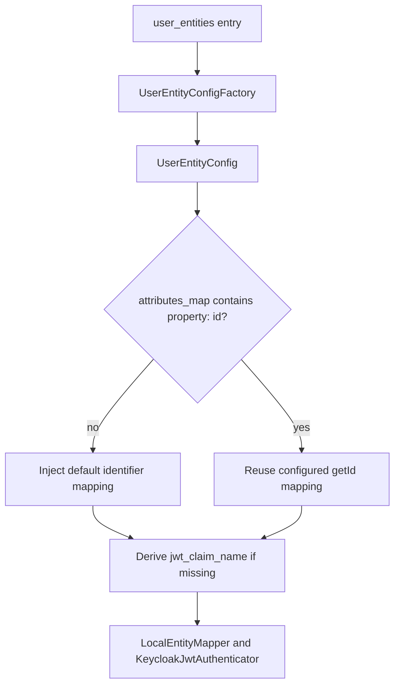

# Configuration Guide

This bundle is designed so the required configuration stays small, while advanced customization remains explicit.

## Required Fields

```yaml
keycloak_bridge:
  base_url: '%env(KEYCLOAK_BASE_URL)%'
  client_realm: '%env(KEYCLOAK_CLIENT_REALM)%'
  client_id: '%env(KEYCLOAK_CLIENT_ID)%'
  client_secret: '%env(KEYCLOAK_CLIENT_SECRET)%'
  callsign: '%env(KEYCLOAK_CALLSIGN)%'
  user_entities:
    App\Entity\User:
      realm: '%env(KEYCLOAK_USERS_REALM)%'
```

That is the minimum supported public configuration.

## Automatic Behavior

When you keep configuration minimal, the bridge still does real work for you:

- `App\Entity\User` must implement `Apacheborys\KeycloakPhpClient\Entity\KeycloakUserInterface`
- `callsign` is required and should be unique per application
- `KeycloakUserInterface::getId()` is treated as the canonical local identifier automatically
- that identifier mapping is inserted into `attributes_map` automatically under `external-user-id`, unless you override it
- every mapped Keycloak attribute value is stored as `callsign.<value>`
- every mapped Keycloak role name is stored as `callsign.` + projected role name
- if the identifier mapping has no explicit `jwt_claim_name`, the bridge derives one automatically
- `LocalEntityMapper` is selected automatically unless you replace it

## Top-Level Options

| Option | Required | Purpose |
| --- | --- | --- |
| `base_url` | yes | Keycloak base URL, for example `https://keycloak.example.com` |
| `client_realm` | yes | Realm where the client credentials live |
| `client_id` | yes | Keycloak client ID used by the bridge |
| `client_secret` | yes | Keycloak client secret |
| `callsign` | yes | Unique application callsign prepended to every Keycloak-facing attribute value and role name |
| `http_client_service` | no | Symfony service ID for PSR-18 client |
| `request_factory_service` | no | Symfony service ID for PSR-17 request factory |
| `stream_factory_service` | no | Symfony service ID for PSR-17 stream factory |
| `cache_pool` | no | PSR-6 cache pool service ID |
| `logger_service` | no | PSR-3 logger service ID |
| `realm_list_ttl` | no | Cache TTL for realm listing |
| `security.expose_infrastructure_failure_status` | no | Keep operational `429`/`502`/`503` statuses from authenticator failures instead of collapsing them to `401` |

If you omit the service IDs, the bundle relies on container aliases for the related PSR interfaces.

## `security`

Use the `security` block for the authenticator's failure-response policy.

```yaml
keycloak_bridge:
  security:
    expose_infrastructure_failure_status: true
```

Options:

| Option | Required | Default | Purpose |
| --- | --- | --- | --- |
| `expose_infrastructure_failure_status` | no | `true` | When `true`, authentication failures caused by Keycloak rate limiting, invalid upstream responses, or temporary unavailability keep their mapped HTTP statuses. When `false`, the authenticator always returns `401` while still returning a safe reason code and still logging the real upstream context. |

Behavior:

- `true` is the operationally precise default
- `false` is useful when you want every authentication failure to look identical to clients
- this option affects only the HTTP status code returned by `KeycloakJwtAuthenticator`
- logging behavior is unchanged; typed Keycloak failures still log sanitized diagnostic context when `logger_service` is configured

## `user_entities`

Each entry is keyed by class name:

```yaml
keycloak_bridge:
  callsign: '%env(KEYCLOAK_CALLSIGN)%'
  user_entities:
    App\Entity\User:
      realm: '%env(KEYCLOAK_USERS_REALM)%'
```

Per-entity options:

| Option | Required | Default | Purpose |
| --- | --- | --- | --- |
| `realm` | yes | none | Target Keycloak realm for this entity |
| `attributes_map` | no | `[]` | Additional local property to Keycloak attribute mappings |
| `role` | no | `{ allow_creation: false, prefix: '', suffix: '' }` | Entity-level role projection and auto-creation behavior |
| `mapper` | no | `Apacheborys\SymfonyKeycloakBridgeBundle\Mapper\LocalEntityMapper` | Mapper service class for this entity |

The bridge-level bootstrap service:

- `Apacheborys\SymfonyKeycloakBridgeBundle\Service\KeycloakBootstrapper`

uses the resolved entity configuration internally, so the application can simply call:

```php
$this->keycloakBootstrapper->ensureUserIdentifierAttribute(App\Entity\User::class);
```

If you want to bootstrap every configured `attributes_map` entry, use:

```php
$this->keycloakBootstrapper->ensureConfiguredAttributes(App\Entity\User::class);
```

## `attributes_map`

Use `attributes_map` when you want to project more than just the canonical local identifier from `KeycloakUserInterface::getId()`.

```yaml
keycloak_bridge:
  callsign: '%env(KEYCLOAK_CALLSIGN)%'
  user_entities:
    App\Entity\User:
      realm: '%env(KEYCLOAK_USERS_REALM)%'
      attributes_map:
        - property: 'id'
          attribute_name: 'external-user-id'
          create_if_missing: true
          required: false
        - property: 'departmentCode'
          attribute_name: 'department-code'
          jwt_claim_name: 'department_code'
          required:
            roles: ['admin']
        - property: 'firstName'
          attribute_name: 'profile-first-name'
```

Per-attribute options:

| Option | Required | Default | Purpose |
| --- | --- | --- | --- |
| `property` | yes | none | Local entity property name. The reserved value `id` maps to `KeycloakUserInterface::getId()` |
| `attribute_name` | no | same as `property` | Keycloak attribute name. For the auto-injected identifier mapping, the default is `external-user-id` |
| `jwt_claim_name` | no | `null` | If set, the attribute is expected in JWT payload under that claim |
| `create_if_missing` | no | `false` | Declarative metadata for explicit Keycloak bootstrap flows |
| `required` | no | `null` | Optional Keycloak user-profile `required` rule. Accepts `false`, `true`, or `{ roles, scopes }` |

Important behavior:

- the identifier mapping for `KeycloakUserInterface::getId()` exists even if you do not declare it
- use `property: 'id'` when you want to customize that identifier mapping explicitly
- if the identifier mapping omits `attribute_name`, the bridge uses `external-user-id`
- if the identifier mapping omits `jwt_claim_name`, the bridge derives `external_user_id` from that default name
- the value stored in Keycloak for every mapped attribute is prefixed to `callsign.<value>`
- fallback user lookup uses the full callsigned attribute value returned by the mapper
- duplicated `property` values are rejected
- duplicated Keycloak `attribute_name` values are rejected
- blank names are rejected early during container build
- `required: true` means "always required"
- `required: false` explicitly removes Keycloak `required` rules during bootstrap
- omitting `required` leaves the current Keycloak rule as-is; for freshly created attributes this means the underlying client defaults still apply

### `required`

The bridge projects the typed Keycloak `required` fields that are supported by
`apacheborys/keycloak-php-client`.

Examples:

```yaml
attributes_map:
  - property: 'id'
    required: true
  - property: 'departmentCode'
    required:
      roles: ['admin']
      scopes: ['openid']
  - property: 'firstName'
    required: false
```

Interpretation:

- `true` means the attribute is required unconditionally
- `roles` and `scopes` map directly to Keycloak required rules
- `false` tells the bootstrapper to remove the `required` block from that attribute
- `null` or omission means the bridge does not override the existing rule

## `role`

Role behavior is now configured per entity:

```yaml
keycloak_bridge:
  callsign: '%env(KEYCLOAK_CALLSIGN)%'
  user_entities:
    App\Entity\User:
      realm: '%env(KEYCLOAK_USERS_REALM)%'
      role:
        allow_creation: true
        prefix: 'payment.'
        suffix: '.svc'
```

Role options:

| Option | Required | Default | Purpose |
| --- | --- | --- | --- |
| `allow_creation` | no | `false` | Allow the default mapper to emit placeholder `RoleDto` objects for roles missing in Keycloak |
| `prefix` | no | `''` | Prefix applied before local role names are projected |
| `suffix` | no | `''` | Suffix applied after local role names are projected |

Behavior:

- local role names are projected through `prefix` and `suffix`, and then the bundle prepends `callsign.`
- if a projected role already exists in Keycloak, the mapper reuses the existing `RoleDto`
- if a projected role is missing and `allow_creation=true`, the default mapper returns a placeholder `RoleDto`, and `keycloak-php-client` creates the role during synchronization
- if a projected role is missing and `allow_creation=false`, the default mapper throws explicitly instead of silently dropping the role

Example:

```yaml
keycloak_bridge:
  callsign: '%env(KEYCLOAK_CALLSIGN)%'
  user_entities:
    App\Entity\User:
      realm: '%env(KEYCLOAK_USERS_REALM)%'
      role:
        prefix: 'payment.'
        suffix: '.svc'
```

With that config:

- `ROLE_USER` becomes `billing.payment.ROLE_USER.svc`
- `ROLE_KYC_MANAGER` becomes `billing.payment.ROLE_KYC_MANAGER.svc`

## Custom Mapper

If the default login, attribute projection, or role projection rules do not fit your app, switch one entity to a custom mapper.

```yaml
keycloak_bridge:
  callsign: '%env(KEYCLOAK_CALLSIGN)%'
  user_entities:
    App\Entity\User:
      realm: '%env(KEYCLOAK_USERS_REALM)%'
      mapper: App\Keycloak\UserMapper
```

Your mapper must implement:

- `Apacheborys\KeycloakPhpClient\Mapper\LocalKeycloakUserBridgeMapperInterface`

The bundle resolves the configured mapper automatically and wraps it internally so attribute values, fallback lookup value, and final role names still receive the configured `callsign.` prefix.

If the mapper needs constructor arguments, define it as a normal Symfony service. Custom mappers should return raw local values and raw final role names without the `callsign.` prefix; the bundle applies that prefix centrally.

## Resolution Flow



## When to Keep It Minimal

Stay with the minimal config if:

- `getId()` already returns the local-to-Keycloak reference you want
- the default mapper can use `getUsername()`, `getEmail()`, and roles as-is
- you do not need extra JWT claims beyond the identifier

Move to `attributes_map` or a custom mapper only when your application actually needs it.
