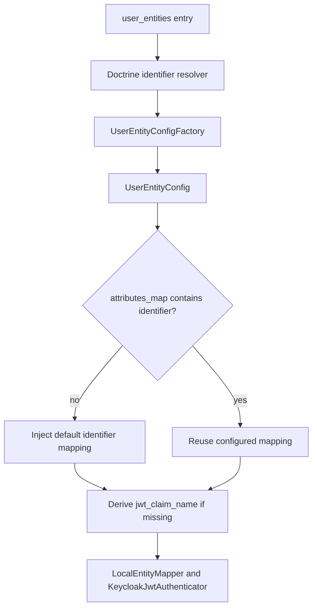

# Configuration Guide

This bundle is designed so the required configuration stays small, while advanced customization remains explicit.

## Required Fields

```yaml
keycloak_bridge:
  base_url: '%env(KEYCLOAK_BASE_URL)%'
  client_realm: '%env(KEYCLOAK_CLIENT_REALM)%'
  client_id: '%env(KEYCLOAK_CLIENT_ID)%'
  client_secret: '%env(KEYCLOAK_CLIENT_SECRET)%'
  user_entities:
    App\Entity\User:
      realm: '%env(KEYCLOAK_USERS_REALM)%'
```

That is the minimum supported public configuration.

## Automatic Behavior

When you keep configuration minimal, the bridge still does real work for you:

- `App\Entity\User` must be Doctrine-managed
- Doctrine resolves the canonical identifier field automatically
- that identifier field is inserted into `attributes_map` automatically
- if the identifier mapping has no explicit `jwt_claim_name`, the bridge derives one automatically
- `LocalEntityMapper` is selected automatically unless you replace it

## Top-Level Options

| Option | Required | Purpose |
| --- | --- | --- |
| `base_url` | yes | Keycloak base URL, for example `https://keycloak.example.com` |
| `client_realm` | yes | Realm where the client credentials live |
| `client_id` | yes | Keycloak client ID used by the bridge |
| `client_secret` | yes | Keycloak client secret |
| `http_client_service` | no | Symfony service ID for PSR-18 client |
| `request_factory_service` | no | Symfony service ID for PSR-17 request factory |
| `stream_factory_service` | no | Symfony service ID for PSR-17 stream factory |
| `cache_pool` | no | PSR-6 cache pool service ID |
| `logger_service` | no | PSR-3 logger service ID |
| `allow_role_creation` | no | Allow creation of missing Keycloak roles during sync |
| `realm_list_ttl` | no | Cache TTL for realm listing |

If you omit the service IDs, the bundle relies on container aliases for the related PSR interfaces.

## `user_entities`

Each entry is keyed by class name:

```yaml
keycloak_bridge:
  user_entities:
    App\Entity\User:
      realm: '%env(KEYCLOAK_USERS_REALM)%'
```

Per-entity options:

| Option | Required | Default | Purpose |
| --- | --- | --- | --- |
| `realm` | yes | none | Target Keycloak realm for this entity |
| `attributes_map` | no | `[]` | Additional local property to Keycloak attribute mappings |
| `role_prefix` | no | `''` | Prefix applied before local role names are projected |
| `role_suffix` | no | `''` | Suffix applied after local role names are projected |
| `mapper` | no | `Apacheborys\SymfonyKeycloakBridgeBundle\Mapper\LocalEntityMapper` | Mapper service class for this entity |

## `attributes_map`

Use `attributes_map` when you want to project more than just the Doctrine identifier field.

```yaml
keycloak_bridge:
  user_entities:
    App\Entity\User:
      realm: '%env(KEYCLOAK_USERS_REALM)%'
      attributes_map:
        - property: 'id'
          attribute_name: 'local-user-id'
          create_if_missing: true
        - property: 'departmentCode'
          attribute_name: 'department-code'
          jwt_claim_name: 'department_code'
        - property: 'firstName'
          attribute_name: 'profile-first-name'
```

Per-attribute options:

| Option | Required | Default | Purpose |
| --- | --- | --- | --- |
| `property` | yes | none | Local entity property name |
| `attribute_name` | no | same as `property` | Keycloak attribute name |
| `jwt_claim_name` | no | `null` | If set, the attribute is expected in JWT payload under that claim |
| `create_if_missing` | no | `false` | Declarative metadata for explicit Keycloak bootstrap flows |

Important behavior:

- the Doctrine identifier mapping exists even if you do not declare it
- duplicated `property` values are rejected
- duplicated Keycloak `attribute_name` values are rejected
- blank names are rejected early during container build

## Role Projection

By default local roles are forwarded as-is.

If you need Keycloak-visible namespacing, add prefix and suffix:

```yaml
keycloak_bridge:
  user_entities:
    App\Entity\User:
      realm: '%env(KEYCLOAK_USERS_REALM)%'
      role_prefix: 'payment.'
      role_suffix: '.svc'
```

With that config:

- `ROLE_USER` becomes `payment.ROLE_USER.svc`
- `ROLE_KYC_MANAGER` becomes `payment.ROLE_KYC_MANAGER.svc`

## Custom Mapper

If the default login, attribute projection, or role projection rules do not fit your app, switch one entity to a custom mapper.

```yaml
keycloak_bridge:
  user_entities:
    App\Entity\User:
      realm: '%env(KEYCLOAK_USERS_REALM)%'
      mapper: App\Keycloak\UserMapper
```

Your mapper must implement:

- `Apacheborys\KeycloakPhpClient\Mapper\LocalKeycloakUserBridgeMapperInterface`

The bundle automatically tags the mapper as `keycloak.local_user_mapper`.

If the mapper needs constructor arguments, define it as a normal Symfony service.

## Resolution Flow



## When to Keep It Minimal

Stay with the minimal config if:

- your Doctrine identifier field is already the local-to-Keycloak reference you want
- the default mapper can use `getUsername()`, `getEmail()`, and roles as-is
- you do not need extra JWT claims beyond the identifier

Move to `attributes_map` or a custom mapper only when your application actually needs it.
