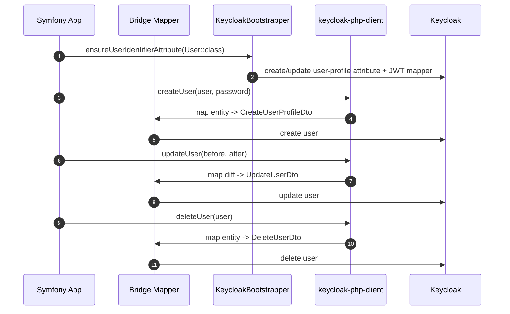

# Quick Start

This is the shortest realistic path from Symfony user entity to working Keycloak integration.

The idea is:

1. configure only the required bundle fields
2. let `KeycloakUserInterface::getId()` define the canonical local user identifier
3. bootstrap that identifier as a Keycloak user-profile attribute once
4. use `KeycloakServiceInterface` for create, update, and delete operations

## Prerequisites

- your user entity implements `Apacheborys\KeycloakPhpClient\Entity\KeycloakUserInterface`
- `KeycloakUserInterface::getKeycloakId()` returns the persisted Keycloak user id when your app stores it locally; otherwise the client falls back to the mapped local-id Keycloak attribute
- Symfony container already exposes:
  `Psr\Http\Client\ClientInterface`,
  `Psr\Http\Message\RequestFactoryInterface`,
  `Psr\Http\Message\StreamFactoryInterface`

## 1. Minimal Bundle Config

```yaml
# config/packages/keycloak_bridge.yaml
keycloak_bridge:
  base_url: '%env(KEYCLOAK_BASE_URL)%'
  client_realm: '%env(KEYCLOAK_CLIENT_REALM)%'
  client_id: '%env(KEYCLOAK_CLIENT_ID)%'
  client_secret: '%env(KEYCLOAK_CLIENT_SECRET)%'
  user_entities:
    App\Entity\User:
      realm: '%env(KEYCLOAK_USERS_REALM)%'
```

What you are not configuring here on purpose:

- no `user_identifier_field`
- no `attributes_map`
- no `mapper`
- no `role` block

The bundle fills the gap automatically:

- `KeycloakUserInterface::getId()` is treated as the canonical local identifier
- that identifier becomes the Keycloak attribute `external-user-id` automatically
- the same identifier is expected in JWT payload automatically as `external_user_id`
- the default mapper is used automatically

This default does not depend on the PHP property name behind `getId()`.
If your local identifier is backed by `$id`, `$uuid`, or anything else, the default Keycloak attribute name is still `external-user-id`.
If you want the Keycloak attribute name to match your own convention, configure it explicitly in `attributes_map` with `property: 'id'`.

```mermaid
flowchart TD
    A[Minimal keycloak_bridge config] --> B[Bundle uses KeycloakUserInterface::getId()]
    B --> C[Bridge builds UserEntityConfig]
    C --> D[LocalEntityMapper projects identifier into Keycloak attributes]
    C --> E[KeycloakJwtAuthenticator expects the same claim in JWT]
```

## 2. Bootstrap the Identifier Attribute in Keycloak

The bridge does not call Keycloak bootstrap operations automatically.
This is deliberate: Keycloak schema and protocol-mapper changes should be explicit.

The usual pattern is to run this once during deployment, migration, or bootstrap.

```php
<?php

declare(strict_types=1);

namespace App\Keycloak;

use Apacheborys\SymfonyKeycloakBridgeBundle\Service\KeycloakBootstrapper;
use App\Entity\User;

final readonly class KeycloakSetup
{
    public function __construct(
        private KeycloakBootstrapper $keycloakBootstrapper,
    ) {
    }

    public function bootstrap(): void
    {
        $this->keycloakBootstrapper->ensureUserIdentifierAttribute(User::class);
    }
}
```

Notes:

- the bridge resolves realm, attribute name, display name, and JWT claim from bundle configuration
- the bridge does not care how the identifier is stored internally as long as `getId()` returns the correct value
- with minimal config, the bootstrapper creates `external-user-id` and exposes it as the JWT claim `external_user_id`
- if you customized identifier mapping through `attributes_map` with `property: 'id'`, the bootstrapper uses that configuration too

If you configured extra `attributes_map` entries with `create_if_missing`,
`jwt_claim_name`, or `required`, bootstrap all of them explicitly:

```php
$this->keycloakBootstrapper->ensureConfiguredAttributes(User::class);
```

## 3. Create, Update, and Delete Users

Once the attribute is bootstrapped, the service API is intentionally small.

```php
<?php

declare(strict_types=1);

namespace App\Keycloak;

use App\Entity\User;
use Apacheborys\KeycloakPhpClient\DTO\PasswordDto;
use Apacheborys\KeycloakPhpClient\Service\KeycloakServiceInterface;

final readonly class KeycloakUserLifecycle
{
    public function __construct(
        private KeycloakServiceInterface $keycloak,
    ) {
    }

    public function create(User $user, string $plainPassword): void
    {
        $this->keycloak->createUser(
            localUser: $user,
            passwordDto: new PasswordDto(plainPassword: $plainPassword),
        );
    }

    public function update(User $before, User $after): void
    {
        $this->keycloak->updateUser(
            oldUserVersion: $before,
            newUserVersion: $after,
        );
    }

    public function delete(User $user): void
    {
        $this->keycloak->deleteUser(user: $user);
    }
}
```

The default bridge behavior here is:

- `createUser()` resolves realm from `user_entities`
- `createUser()` sends mapped attributes automatically, including the `getId()` identifier value
- `updateUser()` computes the diff between old and new local user versions
- `updateUser()` and `deleteUser()` use `getKeycloakId()` first and fall back to the mapped local-id Keycloak attribute when it is missing



## 4. Optional Next Steps

If you want more than the default happy path:

- [Configuration Guide](configuration.md)
  for `attributes_map`, entity-level `role` options, custom mapper classes, and infrastructure services
- [Security Guide](security.md)
  for JWT authentication inside Symfony Security
