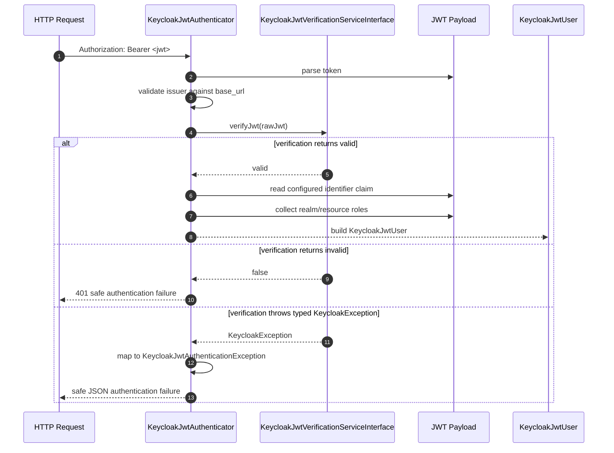

# Security Guide

The bundle ships with `Apacheborys\SymfonyKeycloakBridgeBundle\Security\KeycloakJwtAuthenticator`.

Its job is intentionally narrow:

- read a bearer token from the `Authorization` header
- check that the token issuer belongs to the configured Keycloak base URL
- verify the JWT signature and time-based claims
- resolve the Symfony user identifier from the configured local identifier claim
- project Keycloak realm and resource roles into Symfony roles

During `verifyJwt(...)` it also catches the typed exception model exposed by
`apacheborys/keycloak-php-client` and translates those failures into controlled Symfony
authentication failures instead of letting them bubble into a `500`.

## Firewall Setup

```yaml
# config/packages/security.yaml
security:
  firewalls:
    api:
      stateless: true
      custom_authenticators:
        - Apacheborys\SymfonyKeycloakBridgeBundle\Security\KeycloakJwtAuthenticator
```

## Identifier Claim Resolution

The authenticator does not use `preferred_username` as the canonical Symfony identifier.

Instead it follows the bridge configuration model:

- start from the reserved identifier mapping behind `KeycloakUserInterface::getId()`
- find the `attributes_map` entry with `property: 'id'`, or use the implicit default one
- search the JWT payload for the claim names derived from that mapping

That means:

- with minimal config, the authenticator expects the `external_user_id` claim
- if you rename the Keycloak attribute with `attribute_name`, that name becomes part of the search set
- if you set `jwt_claim_name`, that explicit claim name is also supported
- the identifier claim value itself is expected to be callsigned, for example `billing.58f5b67f-bcf4-4d12-86a3-a54f7704f326`
- the authenticator strips the leading `callsign.` prefix before building `KeycloakJwtUser`

## Why This Matters

This keeps Symfony and Keycloak aligned around the same local user reference.

Typical result:

- Symfony knows the user as local ID `58f5b67f-bcf4-4d12-86a3-a54f7704f326`
- Keycloak stores `callsign.58f5b67f-bcf4-4d12-86a3-a54f7704f326` as a user attribute
- JWT payload contains the same callsigned value as a claim
- the authenticator turns that value into `KeycloakJwtUser::getUserIdentifier()`

The recommended way to prepare that claim in Keycloak is:

- `Apacheborys\SymfonyKeycloakBridgeBundle\Service\KeycloakBootstrapper::ensureUserIdentifierAttribute()`

## Role Extraction

The authenticator merges roles from:

- `realm_access.roles`
- every `resource_access.*.roles`

If the token contains no roles at all, it falls back to:

- `ROLE_USER`

The authenticator keeps role names exactly as they come from Keycloak. If your bridge config uses both `callsign` and entity-level role prefix/suffix, Symfony receives those final Keycloak role names unchanged, for example `billing.payment.ROLE_USER.svc`.

## Request Flow



## Failure Cases

Authentication fails when:

- there is no bearer token
- the token is malformed
- the issuer does not match the configured Keycloak base URL
- signature validation fails
- the configured local identifier claim is missing from the payload

By default the authenticator responds with:

- `401 Unauthorized` for invalid token input
- `429 Too Many Requests` when Keycloak or JWKS lookup is rate limited
- `502 Bad Gateway` when Keycloak returns an invalid response
- `503 Service Unavailable` when Keycloak is temporarily unavailable

That infrastructure-aware behavior comes from typed exceptions raised by
`apacheborys/keycloak-php-client`, including authentication, authorization, rate-limit,
transport, server, and invalid-response failures.

If you want to hide infrastructure state from clients, configure:

```yaml
keycloak_bridge:
  security:
    expose_infrastructure_failure_status: false
```

With that setting:

- the response status is always `401 Unauthorized`
- the response body still contains a safe internal reason code
- typed Keycloak failures still log sanitized diagnostic context when a logger is configured

## Response Body

The authenticator always returns a minimal safe JSON payload:

```json
{
  "message": "Authentication failed.",
  "reason": "keycloak_unavailable"
}
```

Important properties:

- `message` is always the generic user-facing string `Authentication failed.`
- `reason` is a safe machine-readable code such as `malformed_token`,
  `signature_validation_failed`, `keycloak_rate_limited`, or `keycloak_unavailable`
- raw JWT values are never returned
- the `Authorization` header is never returned
- `client_secret`, `access_token`, `refresh_token`, and `password` values are never returned
- raw Keycloak response bodies are not exposed to clients

## Logging

If `logger_service` is configured, typed Keycloak verification failures are logged with
sanitized diagnostic context from `KeycloakErrorContext`.

The authenticator logs:

- `method`
- sanitized `uri`
- `status_code`
- sanitized `keycloak_error`
- sanitized `keycloak_error_description`
- sanitized `correlation_id`
- `exception_class`

Logging behavior:

- authentication and authorization failures are logged at `warning`
- rate limiting is also logged at `warning`
- transport, server, invalid-response, and generic Keycloak failures are logged at `error`
- normal malformed or invalid JWT input is not logged by default

The logger does not receive:

- raw JWT tokens
- the `Authorization` header
- raw Keycloak response bodies
- unsanitized `client_secret`, `access_token`, `refresh_token`, or `password` values

## Typical Extension Point

If the default authenticator is almost right but not enough, keep it and extend around it first:

- add normal Symfony access control rules on top
- use the authenticated `KeycloakJwtUser` in voters or request handlers
- customize Keycloak claims through `attributes_map` before replacing the authenticator itself

Most applications do not need a custom authenticator; they only need the correct identifier claim and role mapping.
