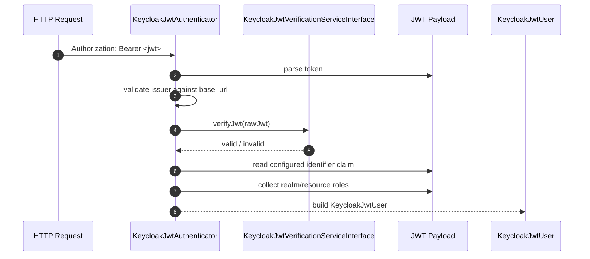

# Security Guide

The bundle ships with `Apacheborys\SymfonyKeycloakBridgeBundle\Security\KeycloakJwtAuthenticator`.

Its job is intentionally narrow:

- read a bearer token from the `Authorization` header
- check that the token issuer belongs to the configured Keycloak base URL
- verify the JWT signature and time-based claims
- resolve the Symfony user identifier from the configured local identifier claim
- project Keycloak realm and resource roles into Symfony roles

## Firewall Setup

```yaml
# config/packages/security.yaml
security:
  firewalls:
    api:
      stateless: true
      custom_authenticators:
        - Apacheborys\SymfonyKeycloakBridgeBundle\Security\KeycloakJwtAuthenticator
```

## Identifier Claim Resolution

The authenticator does not use `preferred_username` as the canonical Symfony identifier.

Instead it follows the bridge configuration model:

- resolve the local identifier field from Doctrine metadata
- find the `attributes_map` entry that corresponds to that field
- search the JWT payload for the claim names derived from that mapping

That means:

- with minimal config and Doctrine ID field `id`, the authenticator expects the `id` claim
- if you rename the Keycloak attribute with `attribute_name`, that name becomes part of the search set
- if you set `jwt_claim_name`, that explicit claim name is also supported

## Why This Matters

This keeps Symfony and Keycloak aligned around the same local user reference.

Typical result:

- Symfony knows the user as local ID `58f5b67f-bcf4-4d12-86a3-a54f7704f326`
- Keycloak stores the same value as a user attribute
- JWT payload contains the same value as a claim
- the authenticator turns that value into `KeycloakJwtUser::getUserIdentifier()`

The recommended way to prepare that claim in Keycloak is:

- `Apacheborys\SymfonyKeycloakBridgeBundle\Service\KeycloakBootstrapper::ensureUserIdentifierAttribute()`

## Role Extraction

The authenticator merges roles from:

- `realm_access.roles`
- every `resource_access.*.roles`

If the token contains no roles at all, it falls back to:

- `ROLE_USER`

## Request Flow



## Failure Cases

Authentication fails when:

- there is no bearer token
- the token is malformed
- the issuer does not match the configured Keycloak base URL
- signature validation fails
- the configured local identifier claim is missing from the payload

The authenticator responds with `401 Unauthorized`.

## Typical Extension Point

If the default authenticator is almost right but not enough, keep it and extend around it first:

- add normal Symfony access control rules on top
- use the authenticated `KeycloakJwtUser` in voters or request handlers
- customize Keycloak claims through `attributes_map` before replacing the authenticator itself

Most applications do not need a custom authenticator; they only need the correct identifier claim and role mapping.
